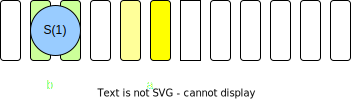
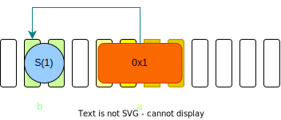

Thanks to the sponsor


---

## Agenda

Lectures: (10:00-12:30)
- Tooling
- Functions & Structs
- Branching & Looping
- Traits
- Memory & Lifetimes
- Enums, matches & errors

----

Workshop: (13:30-17:00)
- Axum Pokedex

---

## Tooling

- Install (Linux/Unix)
```sh
curl --proto '=https' --tlsv1.2 -sSf https://sh.rustup.rs | sh
```

- Installer.exe on Windows

----

```sh
 # Sets up a hello world rust project
cargo init #(--lib)

# Debug build
cargo build #(--release)

# Runs debug app
cargo run

# Add dependencies
cargo add axum
cargo add serde --features derive
```

----

```sh
rustup update # Updates rust version (rustc)
rustup target add aarch64-apple-ios # Adds arm64 apple iOS toolchain
cargo build --release --target aarch64-apple-ios # Builds a release version for apple iOS arm64
```

----

Linter and formatter

```sh
cargo clippy
cargo fmt
```

----

Where to search for libraries

- [Crates.io](https://crates.io/)
- [Lib.rs](https://lib.rs/)


----

Where to find useful things

- [Cheats.rs](https://cheats.rs/)
- [The Rust book](https://doc.rust-lang.org/book/)
- [Rust by Example](https://doc.rust-lang.org/stable/rust-by-example/)

----

IDEs

- VSCode:
  - rust-analyzer
  - CodeLLDB (Linux/Mac) / MSVC Debug tools (Windows)

- CLion (JetBrains):
  - Rust-Plugin

---

`It's your turn! #1`

Fire up your terminal and create your first rust project

```sh
mkdir my-rust-project
cd my-rust-project
cargo init
cargo run
```

----

```
my-rust-project/
├─ src/
│  ├─ main.rs (lib.rs) #main entry point
├─ target/ #build dir
│  ├─ debug/
├─ .gitignore
├─ Cargo.lock
├─ Cargo.toml #your manifest
```

----

Add a dependency - and look into the `Cargo.toml`

```sh
cargo add axum
```

----

```toml
[package]
name = "my-rust-project"
version = "0.1.0"
edition = "2021"

# See more keys and their definitions at https://doc.rust-lang.org/cargo/reference/manifest.html

[dependencies] # lands in your production code
axum = "0.6.18"

[dev-dependencies] # dependencies for e.g. testing
```

More on [manfifests](https://doc.rust-lang.org/cargo/reference/manifest.html).

---

## Functions

Free functions
```rust
fn sum(first: i32, second: i32) -> i32 {
  first + second
}

fn main() {
  let calculation = sum(1, 2);
  assert_eq!(calculation, 3);
}
```

----

Methods - oop
```rust
fn make_sound(dog: &Dog) -> String {
  dog.bark()
}
```

```rust
fn pet(dog: &mut Dog) {
  dog.set_happy();
}
```

----

methods - functional
```rust
let items: Vec<i32> = vec![6, 4, 2, 4];
let filtered_items: Vec<&i32> = items
  .iter()
  .filter(|it| *it > 4) // "combinators"
  .collect();

assert_eq(filtered_items, vec[&6]);
```

---

## Structs

Definition with Impl Block

```rust
pub struct Dog {
  is_happy: bool
}

impl Dog {
  pub fn new() -> Dog {
    Dog { is_happy: false }
  }
  pub fn bark(&self) -> String {
    "Woof".to_string()
  }
  pub fn set_happy(&mut self) {
    self.is_happy = true;
  }
}
```

----

Invocation

```rust
let dog = Dog{is_happy: false}; // <- directly
dog.bark();
let mut dog = Dog::new(); // <- factory function
dog.set_happy(); // <-- mutates dog
```
---

## Branching & Looping

Branching

```rust
let dog_is_happy = true;
if dog_is_happy {
} else {}

match dog_is_happy {
    true => {...},
    false => {...}
}

let maybe_dog: Option<Dog> = Some(Dog);
if let Some(dog) = maybe_there {
}
```

----

Looping

```rust
loop { // endless loop
  break;
}
while dog_is_happy { // while - condition
}
while let Some(dog) = maybe_dog { // while - expression
}
```

----

Looping with containers (Iterators)
```rust
let items: Vec<i32> = vec![1,2,3,4];

for item in items {}; // for - elems
for i in 0..items.len(){}; // for - ranges
items.iter().for_each(|item| {}); // <- combinators
```

---

## Traits

Impl Blocks

```rust
pub trait MakeSound {
  fn make_sound(&self) -> String;
}

impl MakeSound for Dog {
  fn make_sound(&self) -> String {
    self.bark()
  }
}
```

```rust
impl MakeSound for Cat {
  fn make_sound(&self) -> String {
    self.miauw()
  }
}
```

----

Polymorphism (static)
```rust
struct Record(String);
pub fn record_sound<T: MakeSound>(sound_maker: &T) -> Record {
  Record(sound_maker.make_sound().clone())
}
```

----

Polymorphism (dynamic)
```rust
let sound_makers: Vec<Box<dyn MakeSound>> = 
        vec[Box::new(Dog::new()), Box::new(Cat::new())];
```

----

Trait **auto-implementation** with derive macros
```rust
#[derive(serde::Serialize, serde::Deserialize)]
struct Dog {
  age: i32,
  name: String,
  dog_keeper: String,
}
let dog = Dog{
    age: 1, 
    name: "Kevin".to_string(), 
    dog_keeper: "Alice".to_string()
};
let json = serde_json::to_string(&dog);
```

```json
{
  "age" : 1,
  "name" : "Kevin",
  "dog_keeper" : "Alice"
}
```

---

`It's your turn! #2`

Try to solve the mistakes of the reckless developer:

```sh
git clone git@github.com:rust-basel/traits.git
```

---
## Memory
Moves

```rust
let a = S(1);
```


```rust
let b = a;
```



----

References



```rust
let b = S(1);
let a: &S = &b;
```

----

## LifeTimes
Scopes
```rust
{ 
    let mut c = S(2);
    c = S(3);  // <- Drop called on `c` before assignment.
    let t = S(1);
    let a = t;
    {
       let x: Box<i32> = Box::new(5)
    } // <- Scope of `x` ends - i32 on heap freed.
}   // <- Scope of `a`, `t`, `c` ends here, drop called on `a`, `c`.
```

----

Borrowing (References)
```rust
{
    let x: i32 = 5;
    let s: &i32 = &h; // ok - reference (borrow) lives shorter
} // <- Drop called on 's', then 'x'
```

```rust
// Borrowed dog lives at least os long it used in this 
// function. This "duration" is called 'a.
fn borrow(borrowed: &Dog){...}
fn borrow<'a>(borrowed: &'a Dog){...}
```

---
## Enums, matches & errors
Enums
```rust
// that's an ADT/sum type!
enum TrafficLight {
  Green, Yellow, Red, // unit variants
  YellowBlinking(u32), // tuple variant
  OutOfService {description: String}, // struct-like variant
}
```
----
Pattern Matching
```rust
// this tests for exhaustive patterns!
match traffic_light {
  Green => drive(),
  Yellow => check_situation_and_decide(),
  Red => stop(),
  YellowBlinking(frequency) => check_situation_and_decide(),
  OutOfService{description} =>  match description {
    String::from("Alien Attack") => drive_like_hell(),
    _ => check_situation_and_decide(),
  }
}
```

----

Error Handling
```rust
enum Result<T, E> {
   Ok(T),
   Err(E),
}
```
```rust
panic!(); //terminates the program
panic!("this is a terrible mistake!");
```
----

Error Handling: The '?' operator:
```rust
// syntactic sugar for match that propagates error types
fn parse(str: &str) -> Result<(), String> {
    let num = _parse(str)?;
    println!("{}", num);
    Ok(())
}
```

---

## Pokedex


src: `https://www.gamefm.com.br/wp-content/uploads/2012/12/Pokedex_DP.png`